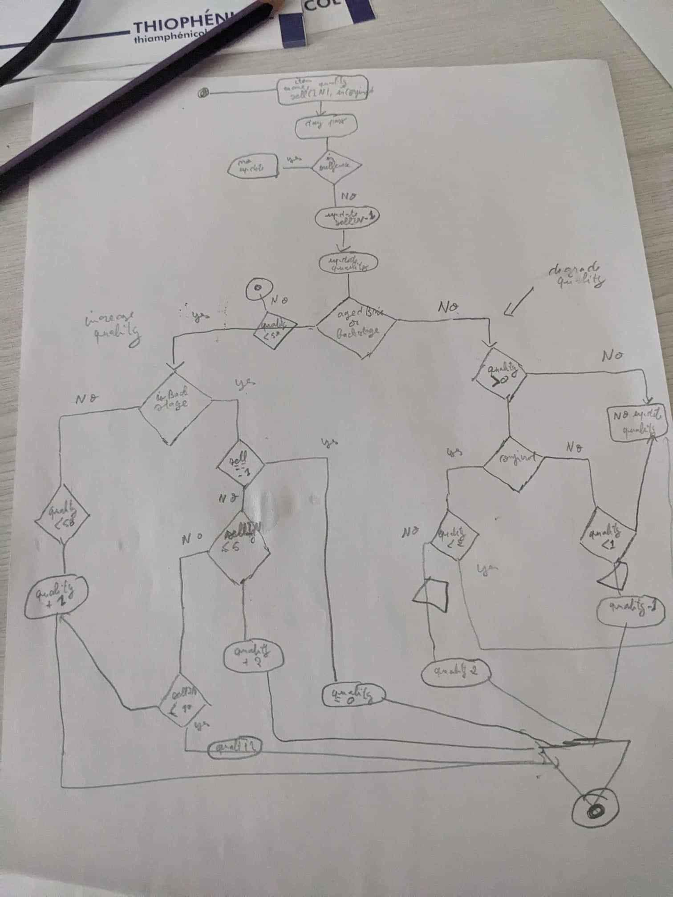

## Getting started

Install dependencies

```sh
npm install
```

## About test

this test took me about 10 hours spread over 2 days (I had other tasks sorry)
I took the time to design my solution, so I started by creating small uml activity diagrams to identify the different cases , implement the solution ,after the implementation i was focusing on the opimization



## Run and Test
you can use the  repo test  command created initially 
```bash
npx ts-node test/golden-master-text-test.ts [day number]
```

but for me this wasn't really a test it shows only the progression of (quality,sellIng) of items so for me without assertion it's just a debugging

for this reason i implement my own test for each case using JEST, please check the file **test/jest/gilded-rose.spec.ts**. to execute the test , please run the following commands:

```bash
npm run test:jest
```

note that the updateSystem method can be more optimized but it depends of the data case every optimization has its own better/worst case so i chosed the most appropriate in my opinion


## Demand
please i like to listen a feedback about my code. i accept any remarks and am open to suggestions.
thank you